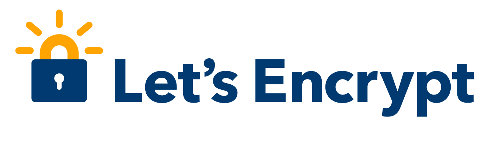
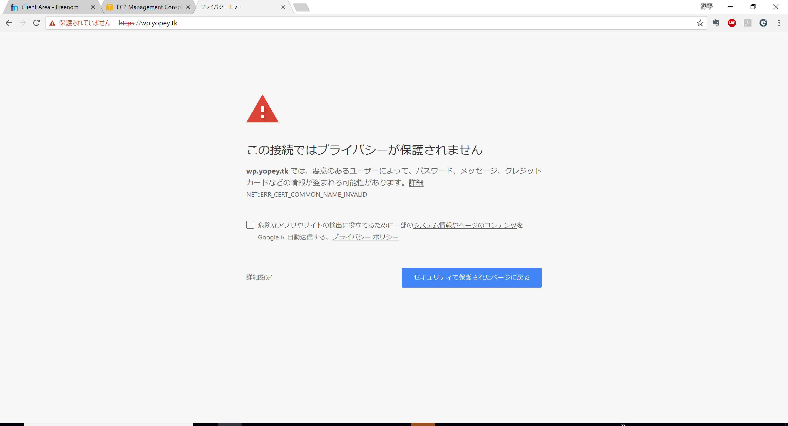
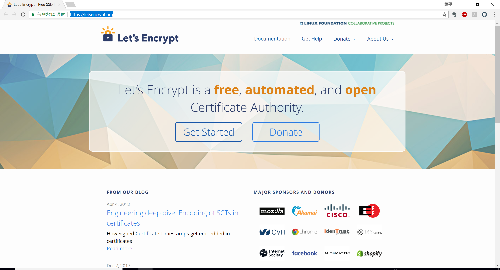
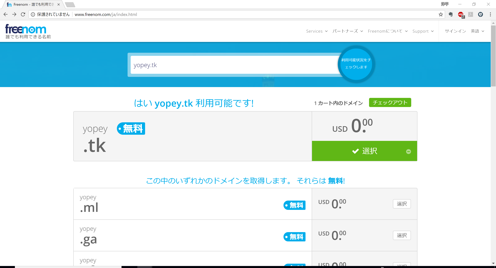
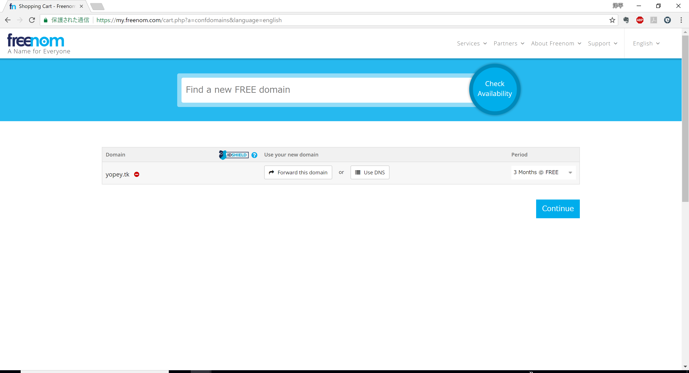
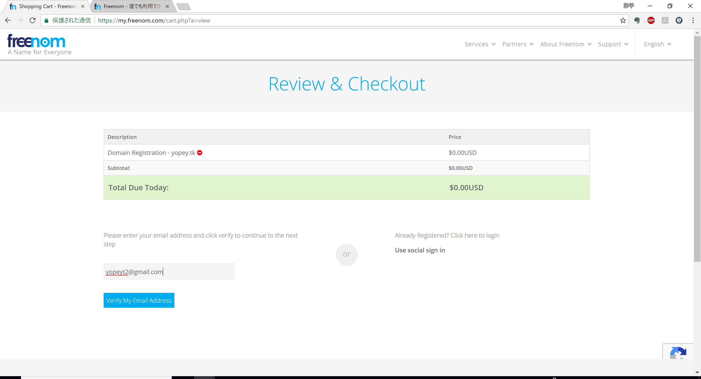
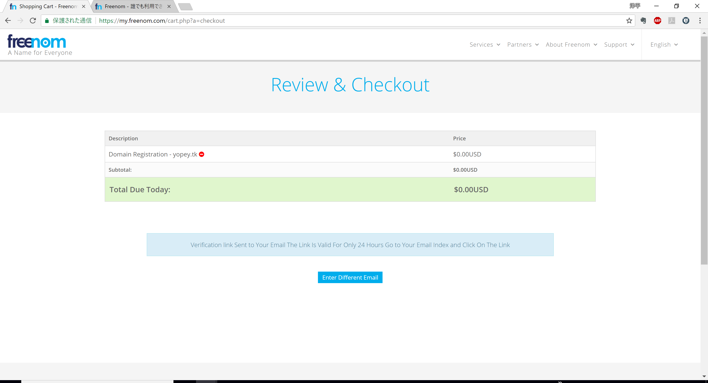
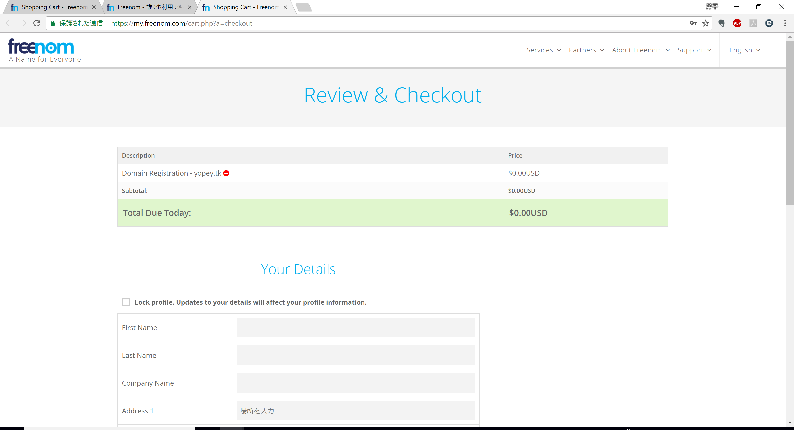
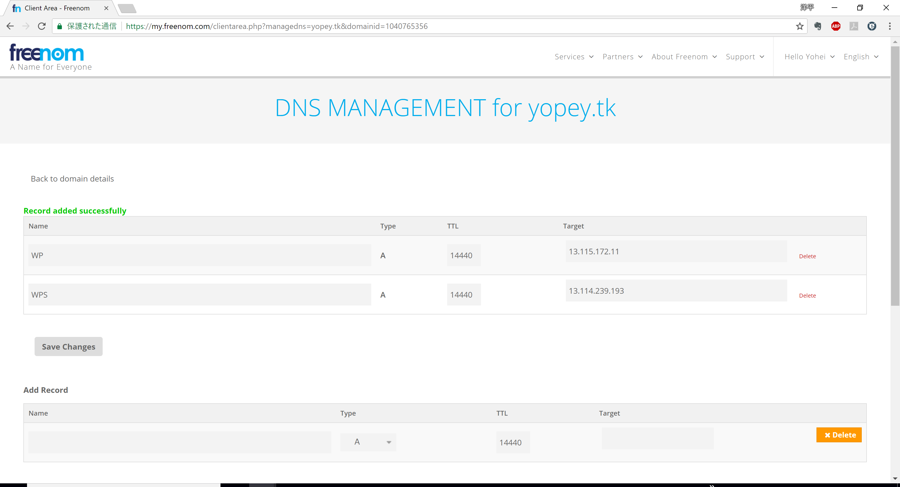
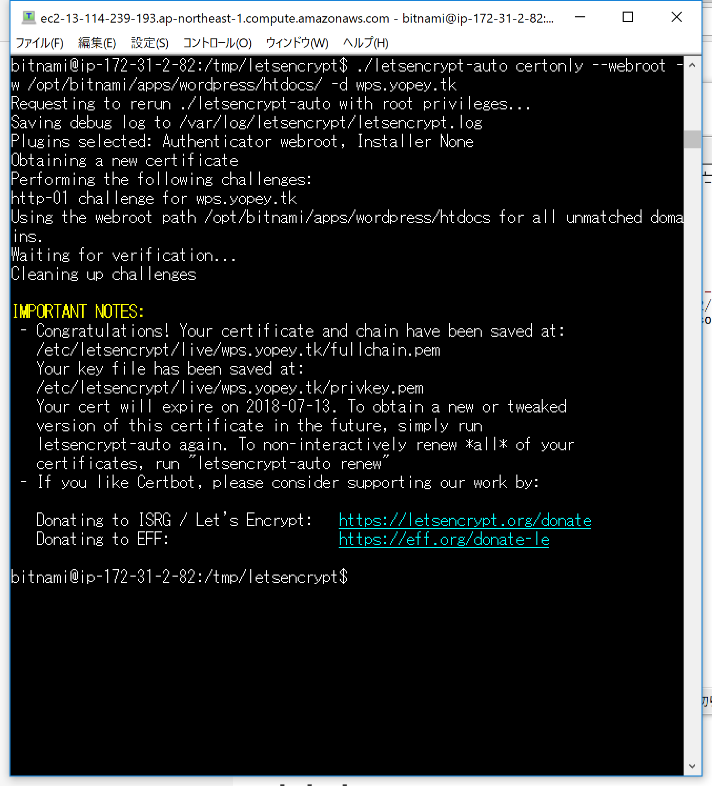

<div align="left">
  <small>
  Wacker #26　2018/04/14(日) <br>
  </small>
</div>

<br>

### Let's Encryptで無料SSLサーバ証明書を発行してセキュリティの高いWebサイトを作ろう

<div>
  
</div>

<br>

<div align="right"> Yohei Taniguchi </div>

<div align="right">
  <small>

    [Wacker](http://wacker.io/)

  </small>
</div>

<div align="right">

  [](http://creativecommons.org/licenses/by-sa/4.0/)

</div>

---

## ある時<hr>

<div>
  
</div>

--

### ない時<hr>

<div>
  
</div>

---

### [Let's Encrypt](https://letsencrypt.org/) とは 1/3 <hr>

<div align="left">
Let's Encrypt は、認証局（CA）として「SSL/TLSサーバ証明書」を無料で発行するとともに、証明書の発行・インストール・更新のプロセスを自動化することにより、TLS や HTTPS（TLSプロトコルによって提供されるセキュアな接続の上でのHTTP通信）を普及させることを目的としているプロジェクトです。2016年4月12日 に正式サービスが開始されました。
</div>

--

### [Let's Encrypt](https://letsencrypt.org/) とは 2/3<hr>

<div align="left">

非営利団体の ISRG (Internet Security Research Group) が運営しており、シスコ（Cisco Systems）、Akamai、電子フロンティア財団（Electronic Frontier Foundation）、モジラ財団（Mozilla Foundation）などの大手企業・団体が、ISRG のスポンサーとして Let's Encrypt を支援しています。
</div>

<div align="right">
  <small>

    （引用：Let's Encrypt 総合ポータル　https://letsencrypt.jp/ )

  </small>
</div>
<div>
  
</div>
--

### [Let's Encrypt](https://letsencrypt.org/) とは 3/3<hr>

- 2016年03月 登場から7か月間にして100万通目証明書発行
- 2016年04月 200万通目の証明書を発行
- 2016年06月 500万通以上の証明書を発行
- 2016年09月 1000万通以上の証明書を発行
- 2016年11月 2000万通以上の証明書を発行
- 2016年12月 2400万通以上の証明書を発行
- 2017年06月 1億通目の証明書を発行

<div align="right">
  <small>

    （引用・一部修正：Wikipedia　https://ja.wikipedia.org/wiki/Let%27s_Encrypt )

  </small>
</div>

---

### 基本方針 1/2<hr>

- Free: Anyone who owns a domain name can use Let’s Encrypt to obtain a trusted certificate at zero cost.
- Automatic: Software running on a web server can interact with Let’s Encrypt to painlessly obtain a certificate, securely configure it for use, and automatically take care of renewal.
- Secure: Let’s Encrypt will serve as a platform for advancing TLS security best practices, both on the CA side and by helping site operators properly secure their servers.

--

### 基本方針 2/2<hr>

- Transparent: All certificates issued or revoked will be publicly recorded and available for anyone to inspect.
- Open: The automatic issuance and renewal protocol will be published as an open standard that others can adopt.
- Cooperative: Much like the underlying Internet protocols themselves, Let’s Encrypt is a joint effort to benefit the community, beyond the control of any one organization.

<div align="right">
  <small>

    （引用：https://letsencrypt.org/about/ ）

  </small>
</div>

---

### SSLサーバ証明書とは<hr>

--

#### SSL/TSL<hr>

- SSL(Secure Sockets Layer) → TSL(Transport Layer Security)
- OSI参照モデルにおけるアプリケーション層でのセキュア通信プロトコル

--

#### 公開鍵基盤（Public Key Infrastructure、PKI）<hr>

- 公開鍵暗号
  - 暗号化と復号に別個の鍵（手順）を用いた暗号方式
  - 公開鍵と秘密鍵
- 認証局（Certificate Authority、CA）
  - サーバが作成する公開鍵の認証
  - 公開鍵の発行

---

### SSLサーバ証明書の種類 <hr>

--

#### ドメイン認証（Domain Validation:DV）<hr>

- ドメインの所有権を確認
- キャンペーンサイト、組織内サイト、手軽に暗号化通信を行いたいサイト

--

#### 企業認証（Organization Validation:OV）<hr>

- ドメインの所有権に加えて、企業の実在性を確認
- 用途：企業ホームページ、会員制サイト

--

#### EV認証（Extended Validation:EV）<hr>

- ドメイン認証 ＋ 企業実在認証に加えて、業界基準の厳格な認証プロセスを経る
- 用途：ネットショップ、オンライン金融サービス、常時SSLサイト

--

### SSL通信の必要性は？ <hr>

1. 暗号化による盗聴・改竄防止
1. ウェブサイトの存在証明
1. 通信の正当性の確保

--

### SSL通信の必要性は？(その2) <hr>

#### Chromeの強制的な警告表示が2018年7月から開始

<div align="left">

2017年初頭から Google Chrome ブラウザは、SSLサーバー証明書（以下SSL証明書）を導入していないサイトに対して、アドレスバーによる警告表示を段階的に強化してきました。そして今回2018年7月リリース予定のChrome 68より、SSL証明書を導入していない全てのサイトで「保護されていません」の警告表示が開始されます。

<div>

<div align="right">
  <small>

    （引用：引用：さくらのSSLコラム　https://ssl.sakura.ad.jp/column/https-not-valid3/ ）

  </small>
</div>

---

### 準備 <hr>

1. サーバ:
   - https://aws.amazon.com/jp/
1. ドメイン
   - https://my.freenom.com/
1. Let's Encryptクライアント
   - https://certbot.eff.org/
   - 参考：Dockerモジュール：https://github.com/SteveLTN/https-portal

--

### 手順

--

#### サーバ構築<hr>

- Wordpressを立てて（ry

---

#### ドメイン取得 <hr>

- [Freenom](http://www.freenom.com/)を利用して無料のドメインを準備

<div>
  
</div>

--

#### ドメイン選択 <hr>

<div>
  
</div>

--

#### ドメインの使い方 <hr>

<div>
  
</div>

--

#### ドメインの費用確認<hr>

<div>
  
</div>

--

#### ドメインの費用確定 <hr>

<div>
  
</div>

--

#### ドメイン所有者の詳細登録 <hr>

<div>
  
</div>

--

#### ドメインの設定 <hr>

<div>
  
</div>

---

#### Let's Encryptクライアント

1. インストール

``` cmd
cd /tmp
git clone https://github.com/letsencrypt/letsencrypt

cd letsencrypt
./letsencrypt-auto
```

--

1. サーバ証明書の認証

``` cmd
./letsencrypt-auto certonly --webroot -w
  /opt/bitnami/apps/wordpress/htdocs/ -d wps.yopey.tk

```
<div>
  
</div>


--

1. 鍵の配置

``` cmd
sudo cp /etc/letsencrypt/live/wps.yopey.tk/fullchain.pem /opt/bitnami/apache2/conf/server.crt


sudo cp /etc/letsencrypt/live/wps.yopey.tk/privkey.pem /opt/bitnami/apache2/conf/server.key

sudo /opt/bitnami/ctlscript.sh restart apache
```

--

1. サーバ証明書の更新(テスト)

``` cmd
./certbot-auto renew --dry-run
```

---

## 参考<hr>

- [GCPのBitnami WordPressで無料SSL（Let's Encrypt）を導入する](https://qiita.com/solidbox/items/3de1b2a390fc1843e62c)
- [Let’s Encrypt with Certbot](https://qiita.com/sinri/items/21ef2a981e1be2eb6fc0)
- [無料のSSL認証でサイトをHTTPS化する　macサーバ編](https://qiita.com/qiugits/items/f7665685fafa37182909)

---
